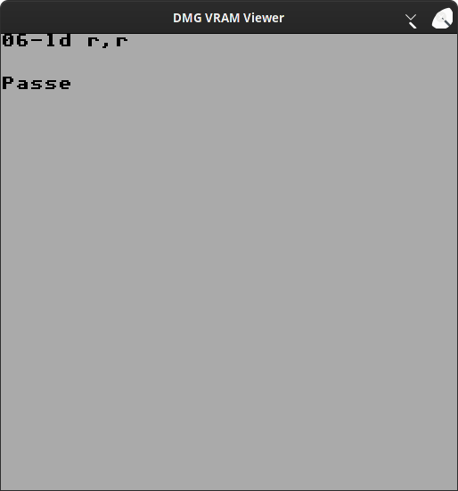

When passed to the tool with `./vram_view <dump.bin>`, this tool can show what was in the VRAM of the DMG Gameboy at the time.

Apologies for the boring screenshot, it's the only dump I had on hand.

